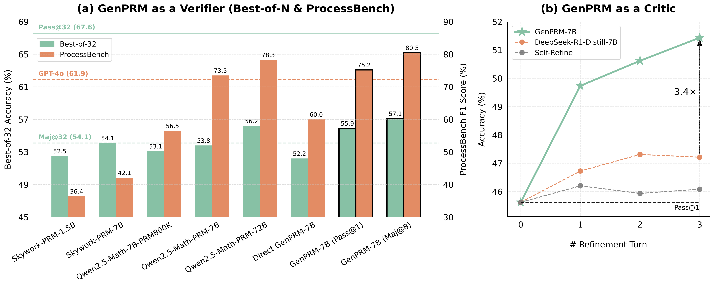
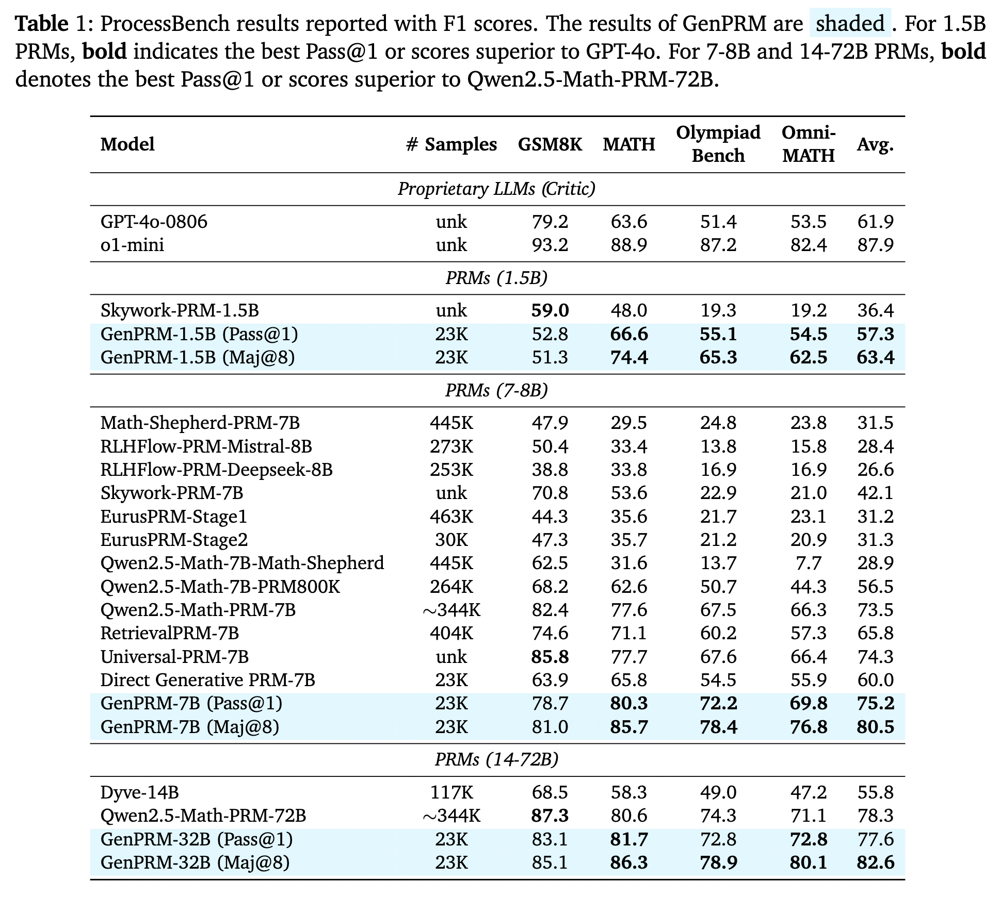
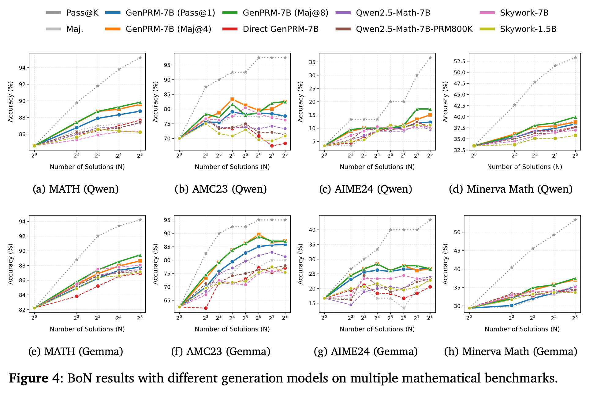
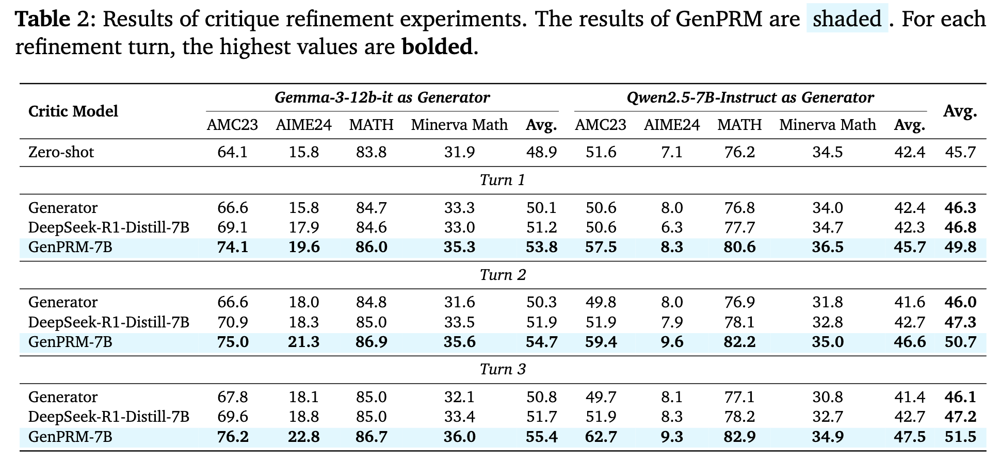

<div align="center">

# GenPRM

[](https://github.com/RyanLiu112/GenPRM/blob/main/static/paper.pdf) [](https://ryanliu112.github.io/GenPRM)  [](https://github.com/RyanLiu112/GenPRM)  [](https://huggingface.co/collections/GenPRM/genprm-67ee4936234ba5dd16bb9943)

</div>

<div align="center">
  <p>
    <a href="#-news" style="text-decoration: none; font-weight: bold;">🔔 News</a> •
    <a href="#-method" style="text-decoration: none; font-weight: bold;">👀 Method</a> •
    <a href="#-results" style="text-decoration: none; font-weight: bold;">🏆 Results</a>
  </p>
  <p>
    <a href="#-getting-started" style="text-decoration: none; font-weight: bold;">🚀 Getting Started</a> •
    <a href="#-citation" style="text-decoration: none; font-weight: bold;">📝 Citation</a> •
    <a href="#-acknowledgement" style="text-decoration: none; font-weight: bold;">💡 Acknowledgement</a>
  </p>
</div>

## 🎯 Overview



We propose **GenPRM**, a strong generative process reward model with the following features:

- reasoning with explicit CoT and code verfication before providing the process judgment;
- improving Monte Carlo estimation and hard label with Relative Progress Estimation (RPE);
- supporting GenPRM **test-time scaling** with majority voting;
- supporting policy model test-time scaling with GenPRM as **verifiers** or **critic** models.

We will release all code, model, and data, including:

- GenPRM with parameters of 1.5B, 7B, 14B, 32B, and 70B (ongoing);
- 23K training data from MATH dataset;
- all details including solution generation, Monte Carlo estimation, RPE, model training and inference (ongoing).


## 🔔 News

- **[2025-04-03]** ✨ Our models (1.5B & 7B) and training data are released on [HuggingFace](https://huggingface.co/collections/GenPRM/genprm-67ee4936234ba5dd16bb9943).
<!-- - **[2025-04-01]** 📄 Our paper is released on [arXiv](https://arxiv.org/abs/2504.00891). -->

## 👀 Method

Our framework:


## 🏆 Results







## 🚀 Getting Started

### Installation

Clone the repository:

```bash
git clone https://github.com/RyanLiu112/GenPRM.git
cd GenPRM/src
```

Create a new conda environment and install the dependencies:

```bash
conda create -n GenPRM python=3.10
conda activate GenPRM
pip install -r requirements.txt
```

TBD

> [!NOTE]
> Our mathematical expression evaluation code is based on [Qwen2.5-Math](https://github.com/QwenLM/Qwen2.5-Math). For a more powerful evaluator, please refer to this repository: [Math-Verify](https://github.com/huggingface/Math-Verify).


## 📝 Citation

If you find this work helpful, please kindly cite our paper:

```bibtex
@article{zhao2025genprm,
    title   = {GenPRM: Scaling Test-Time Compute of Process Reward Models via Generative Reasoning},
    author  = {Jian Zhao and Runze Liu and Kaiyan Zhang and Zhimu Zhou and Junqi Gao and Dong Li and Jiafei Lyu and Zhouyi Qian and Biqing Qi and Xiu Li and Bowen Zhou},
    journal = {arXiv preprint arXiv:2504.00891},
    year    = {2025}
}
```

Our collection of PRMs in [Awesome-Process-Reward-Models](https://github.com/RyanLiu112/Awesome-Process-Reward-Models):

```bibtex
@misc{Awesome-Process-Reward-Models,
    title        = {Awesome Process Reward Models},
    author       = {Runze Liu and Jian Zhao and Kaiyan Zhang and Zhimu Zhou and Junqi Gao and Dong Li and Jiafei Lyu and Zhouyi Qian and Biqing Qi and Xiu Li and Bowen Zhou},
    howpublished = {\url{https://github.com/RyanLiu112/Awesome-Process-Reward-Models}},
    note         = {GitHub repository},
    year         = {2025}
}
```

Our recent work on LLM test-time scaling with PRMs:

```bibtex
@article{liu2025can,
    title   = {Can 1B LLM Surpass 405B LLM? Rethinking Compute-Optimal Test-Time Scaling},
    author  = {Runze Liu and Junqi Gao and Jian Zhao and Kaiyan Zhang and Xiu Li and Biqing Qi and Wanli Ouyang and Bowen Zhou},
    journal = {arXiv preprint arXiv:2502.06703},
    year    = {2025}
}
```

## 💡 Acknowledgement

The model training is based on [axolotl](https://github.com/axolotl-ai-cloud/axolotl) and [RLHFlow](https://github.com/RLHFlow/RLHF-Reward-Modeling/tree/main/math-rm). The mathematical evaluation code is based on [Qwen2.5-Math](https://github.com/QwenLM/Qwen2.5-Math).


